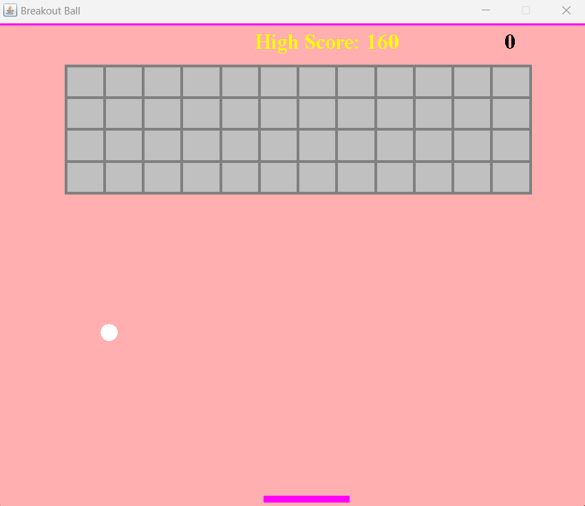

# Object Oriented Programming - Final Project : Brick Breaker 

Brick Breaker is a classic high-paced game of brick-smashing action. Grab power-ups and extra lives before they fall. Can you set a new high score?

## How to use the program

### Program report: coming soon

### Video Link: coming soon

##

All you need to do is run the maingame code.

This is the preview of the game.
